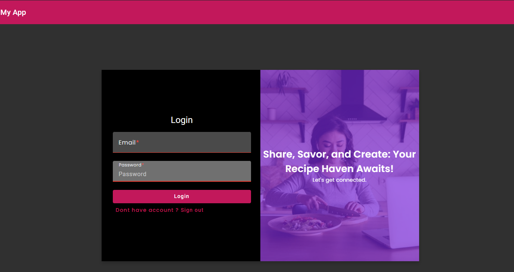
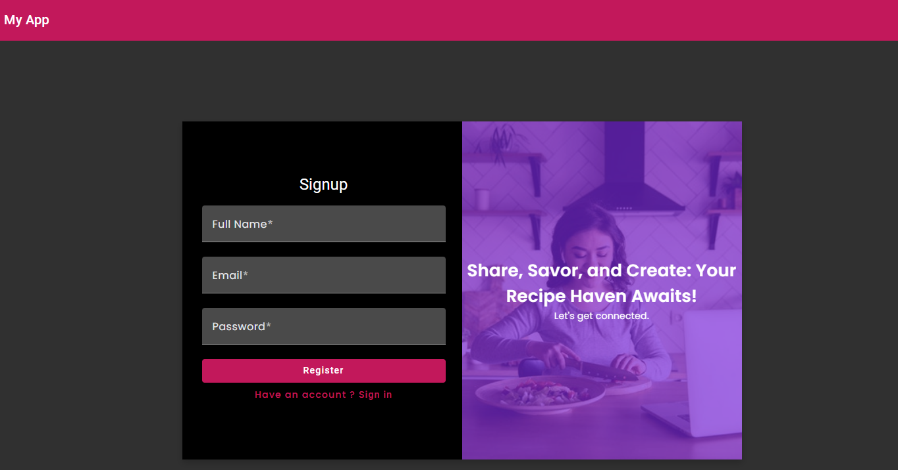
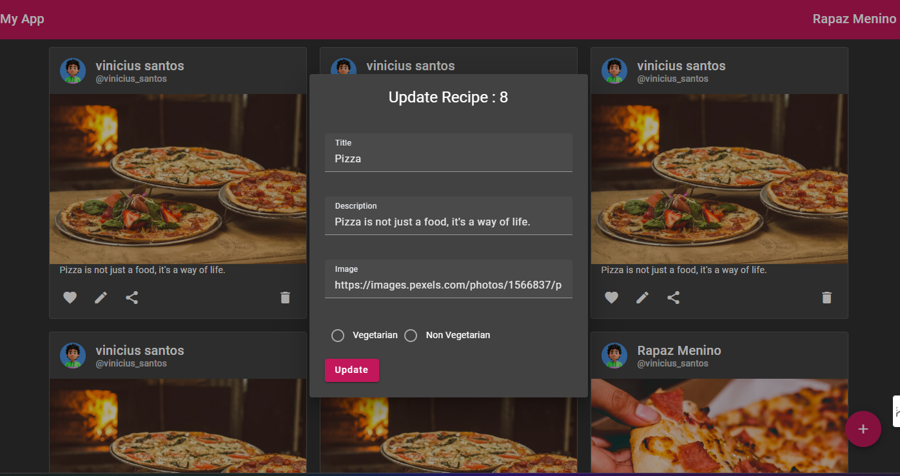

# Aplicação de Compartilhamento de Receitas

## Visão Geral

A Aplicação de Compartilhamento de Receitas é uma plataforma web projetada para permitir que os usuários compartilhem, descubram e gerenciem receitas de maneira fácil e intuitiva. A aplicação foi desenvolvida com um foco em acessibilidade e usabilidade, garantindo que usuários de todos os níveis de habilidade possam utilizá-la com facilidade.

## Funcionalidades

- **Autenticação de Usuários:** Registro, login, recuperação de senha e gerenciamento de sessão.
- **Gerenciamento de Receitas:** Adicionar, visualizar, editar, e excluir receitas.
- **Design Responsivo:** Interface adaptativa que se ajusta a qualquer dispositivo.
- **Busca e Filtragem:** Ferramentas para buscar receitas por palavras-chave e filtrar por categorias.

## Telas da Aplicação

### 1. Tela de Login
- **Descrição:** Interface inicial para autenticação dos usuários.
- **Imagem:** 

### 2. Tela de Registro
- **Descrição:** Permite que novos usuários se registrem na plataforma.
- **Imagem:** 

### 3. Tela de Criação/Atualização de Receita
- **Descrição:** Interface para criar novas receitas ou atualizar as existentes.
- **Imagem:** 

### 4. Tela de Lista de Receitas
- **Descrição:** Exibe todas as receitas disponíveis na aplicação com opções de busca e filtragem.
- **Imagem:** 

## Estrutura do Projeto

### Componentes

- **HomePageComponent:**
    - **Caminho:** `src/app/pages/home-page/home-page.component.ts`
    - **Função:** Exibe uma lista de receitas destacadas.

- **NavbarComponent:**
    - **Caminho:** `src/app/pages/navbar/navbar.component.ts`
    - **Função:** Fornece navegação entre diferentes seções da aplicação.

- **RecipeCardComponent:**
    - **Caminho:** `src/app/pages/recipe-card/recipe-card.component.ts`
    - **Função:** Apresenta os detalhes de uma receita individual.

- **UpdateRecipeFormComponent:**
    - **Caminho:** `src/app/pages/update-recipe-form/update-recipe-form.component.ts`
    - **Função:** Formulário para criação e edição de receitas.

### Serviços

- **AuthService:**
    - **Caminho:** `src/app/services/auth/auth.service.ts`
    - **Função:** Gerencia a autenticação de usuários.

- **RecipeService:**
    - **Caminho:** `src/app/services/recipe/recipe.service.ts`
    - **Função:** Manipula as operações de CRUD (Create, Read, Update, Delete) para as receitas.

### Tecnologias Utilizadas

- **Angular:** Framework front-end para construção de SPA (Single Page Application).
- **TypeScript:** Linguagem de programação que adiciona tipagem estática ao JavaScript.
- **SCSS:** Preprocessador CSS que facilita o gerenciamento de estilos.
- **RxJS:** Biblioteca para programação reativa.

## Diretrizes de Desenvolvimento

- **Arquitetura Modular:** Mantém o código organizado e fácil de manter.
- **Padrões de Nomenclatura:** Seguir as recomendações do Angular para nomes de arquivos e diretórios.
- **Princípio DRY:** Evitar duplicação de código.
- **Testes:** Escrever testes unitários para garantir a robustez da aplicação.

## Instalação e Configuração

1. **Clonar o Repositório:**
   ```bash
   git clone <repository-url>
   cd recipe-sharing
   ```

2. **Instalar Dependências:**
   ```bash
   npm install
   ```

3. **Executar o Servidor de Desenvolvimento:**
   ```bash
   ng serve
   ```

4. **Build da Aplicação:**
   ```bash
   ng build
   ```

5. **Executar Testes:**
   ```bash
   ng test
   ```

## Contribuindo

Contribuições são bem-vindas! Para contribuir:

1. Faça um fork do repositório.
2. Crie um novo branch (`git checkout -b feature/nome-da-feature`).
3. Commit suas mudanças (`git commit -am 'Adicionar nova feature'`).
4. Faça o push para o branch (`git push origin feature/nome-da-feature`).
5. Abra um Pull Request.

