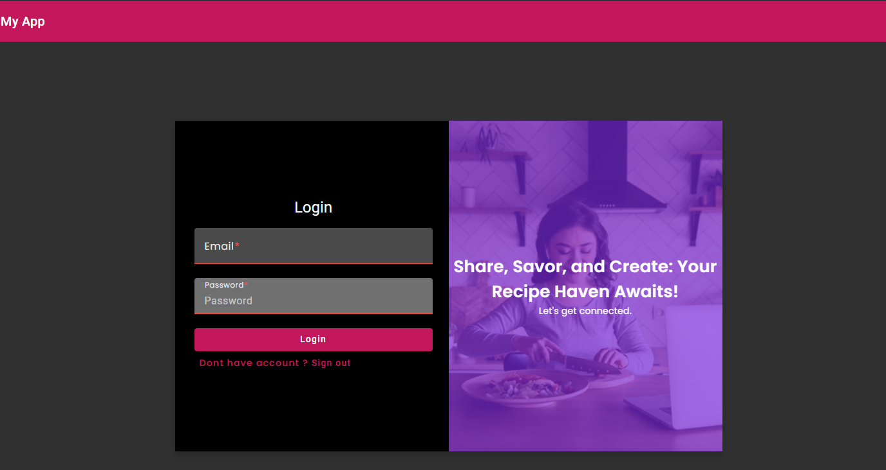
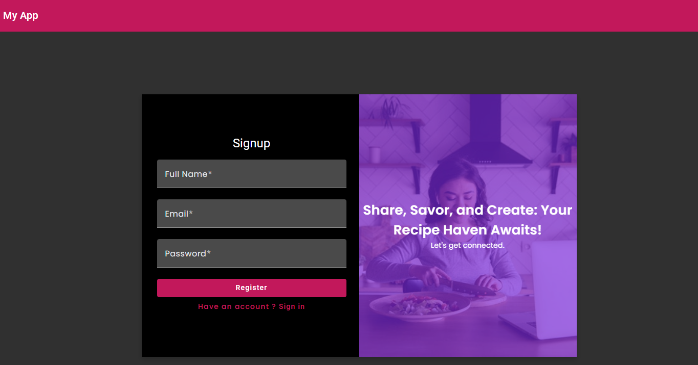
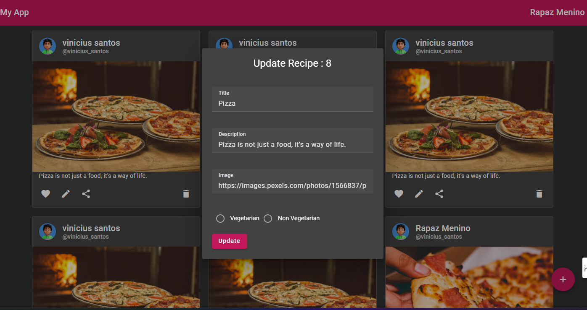
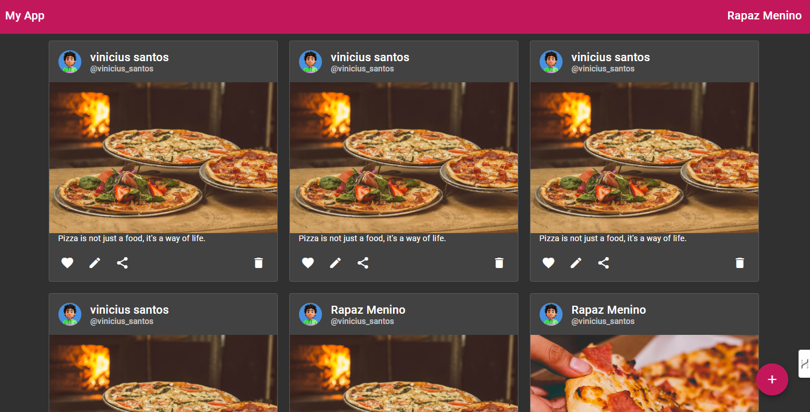

🖥️ **Projeto Detected:** Agora vou adicionar uma seção ao `README.md` para descrever as telas da aplicação com base nas imagens da pasta `img`. 🧑‍💻

---

# Aplicação de Compartilhamento de Receitas

## Visão Geral

A Aplicação de Compartilhamento de Receitas é uma plataforma web que permite aos usuários compartilhar, descobrir e gerenciar diversas receitas. Esta seção do README detalha as principais telas da aplicação, utilizando capturas de tela armazenadas na pasta `img` para ilustrar a interface do usuário.

## Telas da Aplicação

### 1. Tela de Login

- **Descrição:** A tela de login é a primeira interface que o usuário vê ao acessar a aplicação. Ela permite que usuários registrados façam login inserindo suas credenciais. Há também opções para recuperação de senha e redirecionamento para a tela de registro caso o usuário ainda não tenha uma conta.
- **Imagem:** 

### 2. Tela de Registro

- **Descrição:** A tela de registro permite que novos usuários criem uma conta na aplicação. O formulário de registro coleta informações essenciais, como nome, email e senha, e pode incluir confirmações de senha e acordos de termos de uso.
- **Imagem:** 

### 3. Tela de Criação/Atualização de Receita

- **Descrição:** Esta tela permite aos usuários criar uma nova receita ou atualizar uma existente.
- **Imagem:** 

### 4. Tela de Lista de Receitas

- **Descrição:** A tela de lista de receitas exibe todas as receitas disponíveis na aplicação.
- **Imagem:** 

